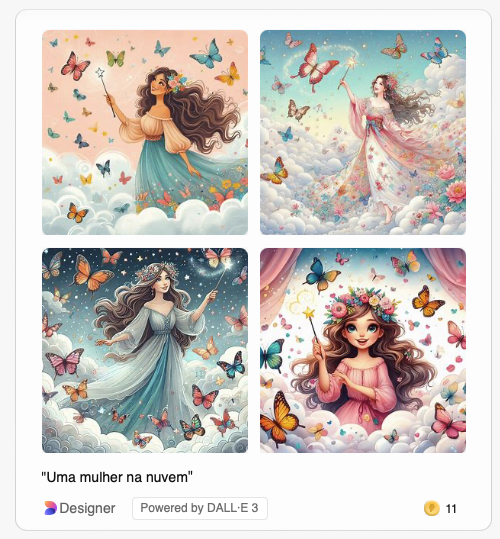
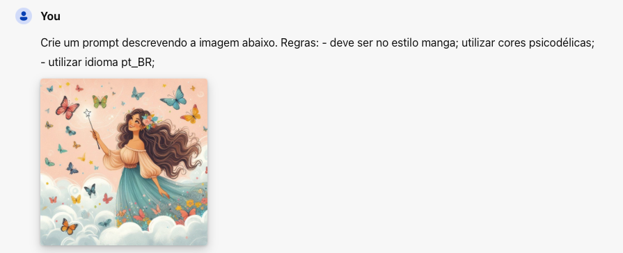

### INPUTS
> Geração de imagem de mulher na nuvem

* criar uma imagem de uma mulher na nuvem

  

> Utilizando imagem criada anteriormente criar um prompt para novas imagens

* Crie um prompt descrevendo a imagem abaixo. Regras: - deve ser no estilo manga; utilizar cores psicodélicas; - utilizar idioma pt_BR;
  

