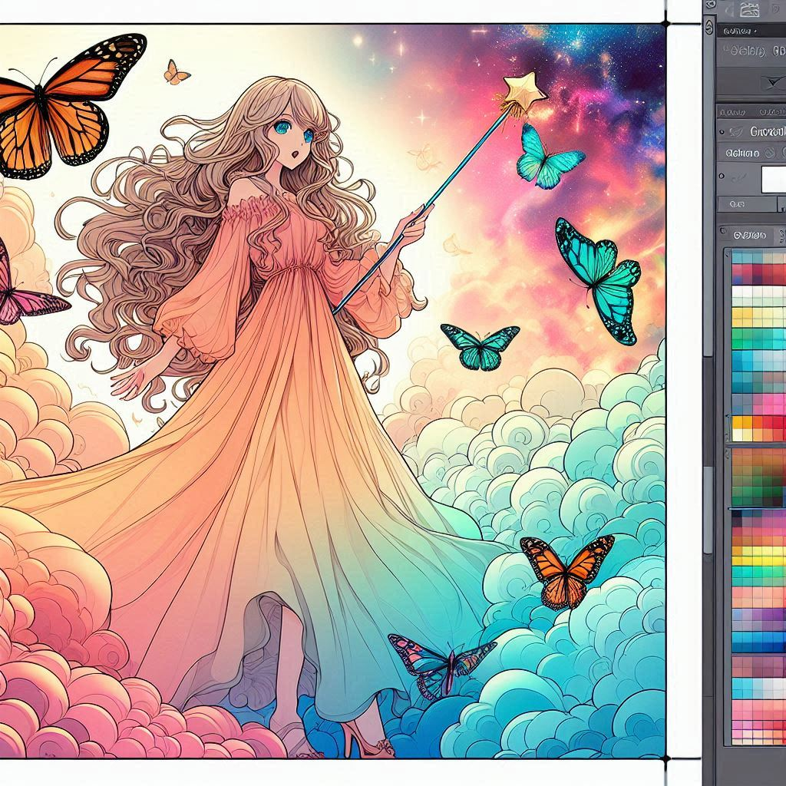

## Output

Resultados obtidos com o input 01:
| 01| 02| 03| 04|
|---|---|---|---|
| | ||   | 

> Prompt gerado como resultado do input 02:
//TODO

Resultados obtidos com o prompt gerado pelo input 02:
| 01| 02| 03| 04|
|---|---|---|---|
| | ||   | 
